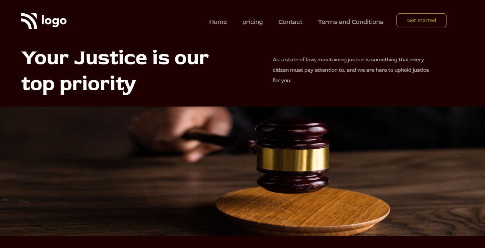

# Project-03/15 
It is a static home page made using **HTML & CSS**.

#### From this project, I've learned:-

1. How to design and style the navbar.
2. The concept of grid and its properties.
3. The concept of display.(block, flex, etc)

> ### The Screenshot of the site is attached here:-

Time taken: 1.5 Hour

> ### The link to the site: [Street style Landing Page](https://aim-law-landing-page.netlify.app/)

